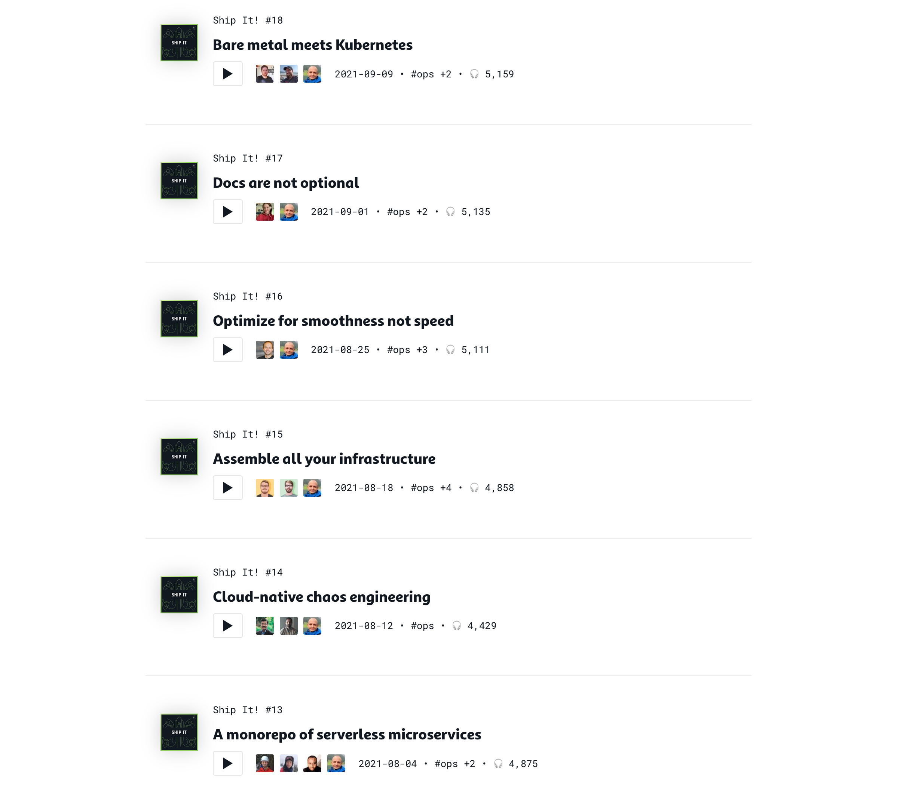
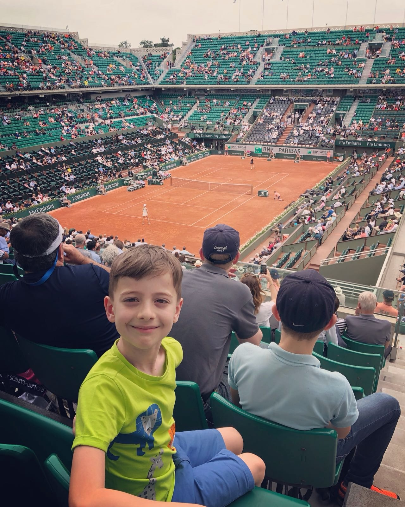
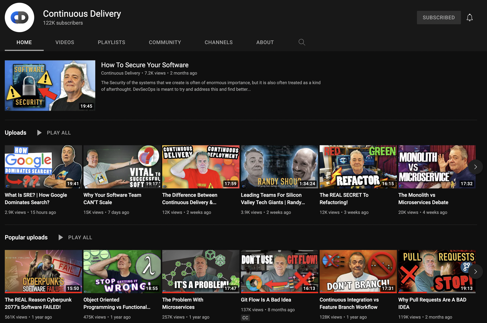
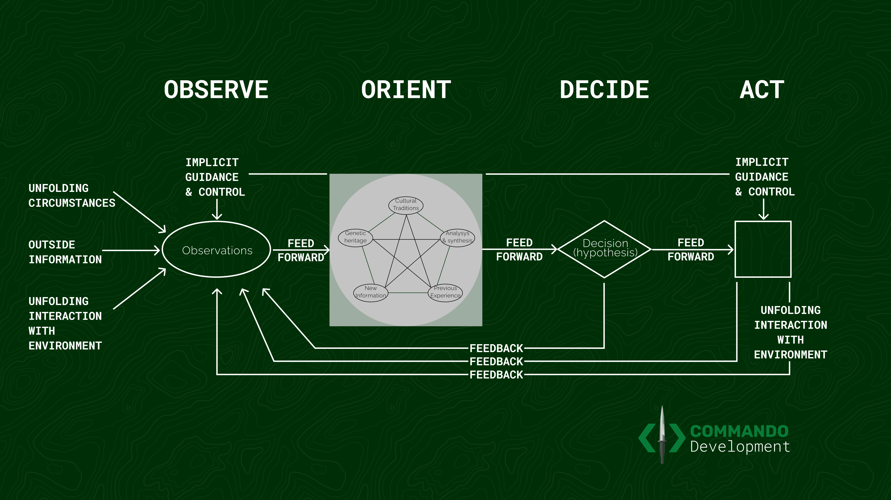
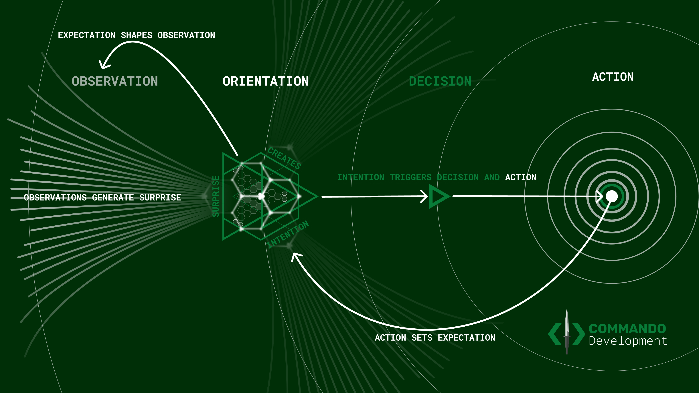
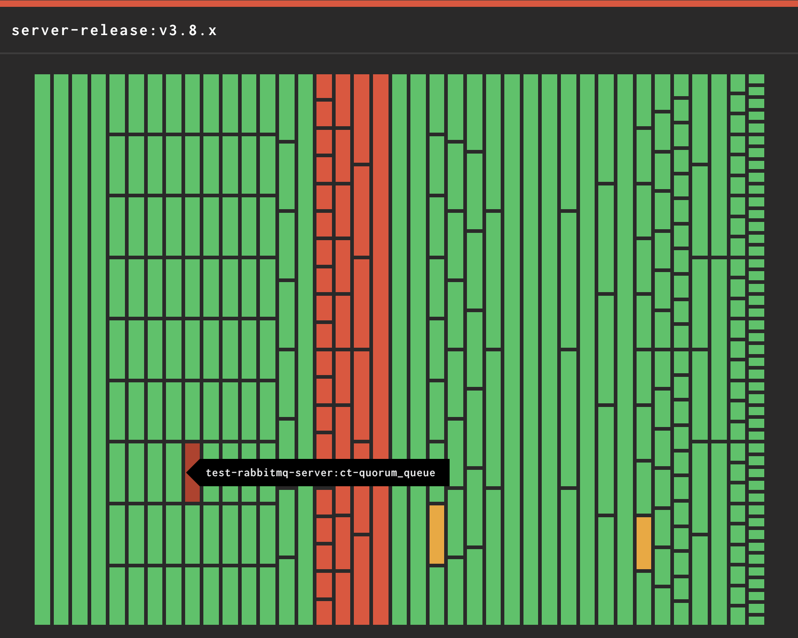
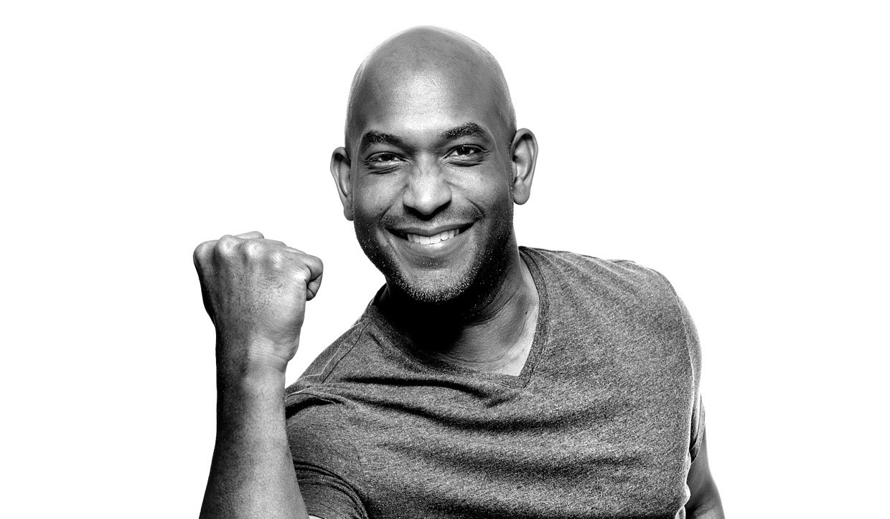
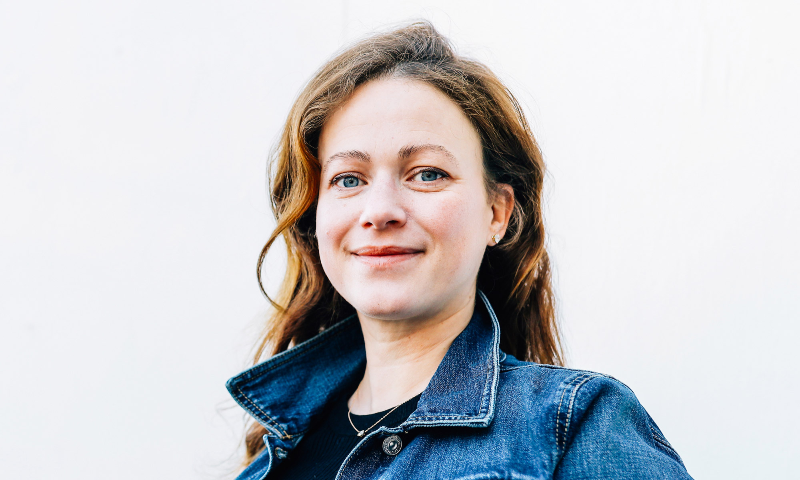
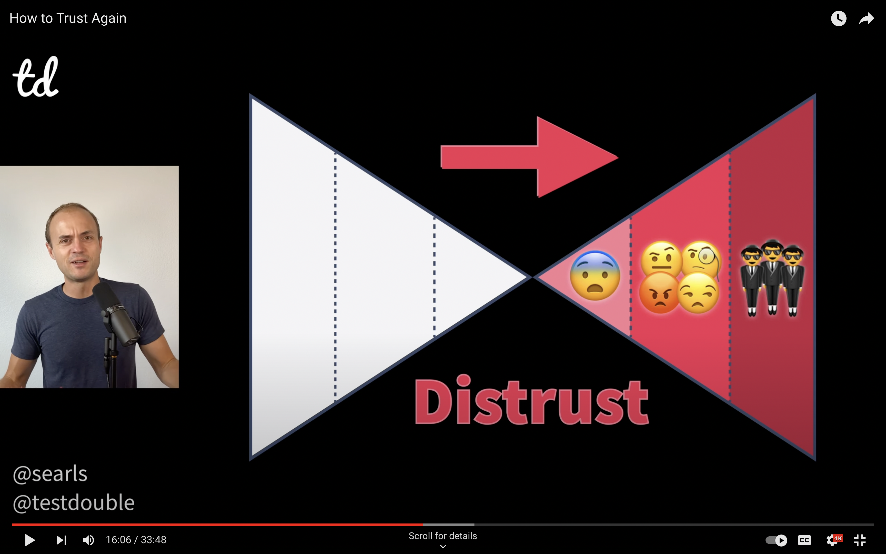
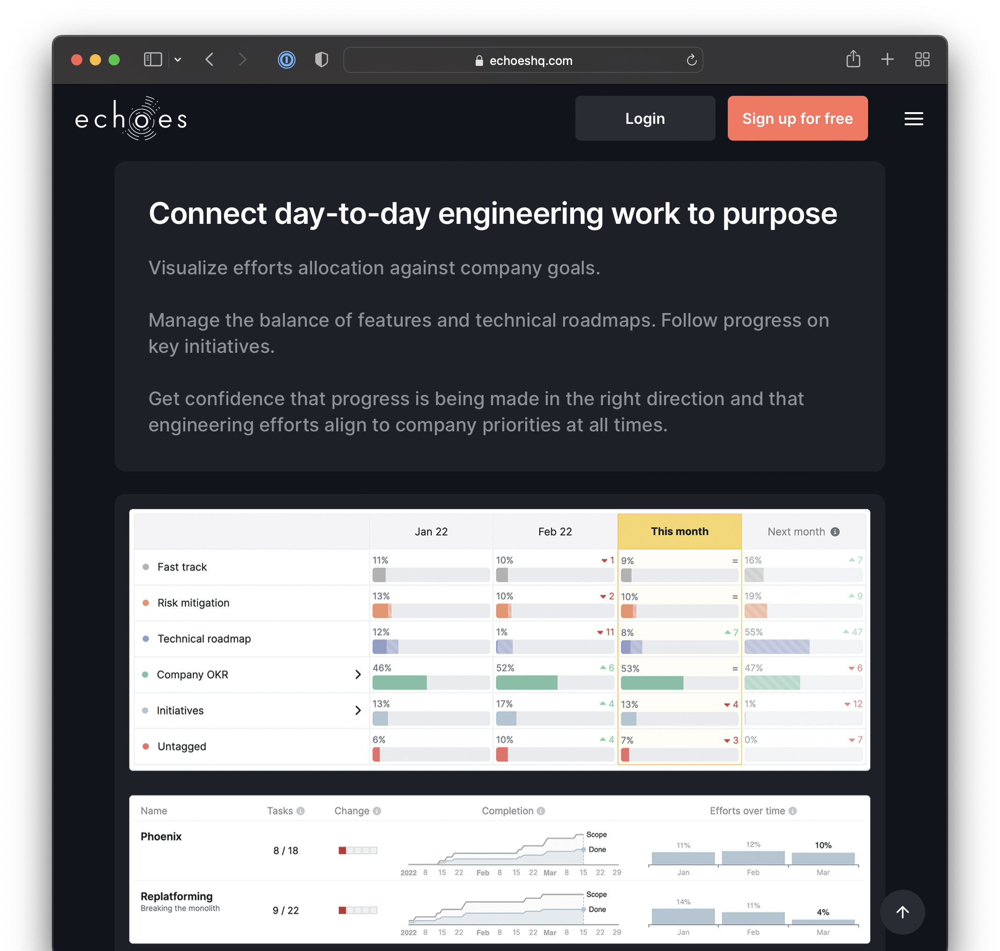

theme: Franziska, 9
link: #40b9bc

[.footer: v2022.06 🍱 [gerhard.io](https://gerhard.io)]

# [fit] 50 Takeaways
##  First year of [shipit.show](https://shipit.show)

---

[.footer: v2022.06 🍱 [gerhard.io](https://gerhard.io)]

# [fit] ~~50~~ 21 Takeaways
##  First year of [shipit.show](https://shipit.show)

---

[.background-color: #40b9bc]

---

---

[.background-color: #40b9bc]

---

[.header: #ffffff]

# [fit] Noah vs. Nadal
## Paris - May, 2018

---

[.footer: Jean-Sébastien Pedron - RabbitMQ & FreeBSD contributor → [shipit.show/9](https://shipit.show/9)]
[.quote: text-scale(0.9)]

> In FreeBSD we pay a lot of attention to breaking changes.

> We have what we call **POLA**: Principle of Least Astonishment

---

[.footer: Dave Farley - inventor of the Deployment Pipeline → [shipit.show/5](https://shipit.show/5)]

> **Start off assuming that we’re wrong**, rather than assuming that we’re right.

> That stuff just works better.

---

[.footer: Dave Farley - inventor of the Deployment Pipeline → [shipit.show/5](https://shipit.show/5)]

> You want to get your ideas into the hands of users quickly and efficiently so that you can **learn, adapt & change.**

---

[.footer: Dave Farley - inventor of the Deployment Pipeline → [shipit.show/5](https://shipit.show/5)]
[.autoscale: true]

> **The ability to make small changes quickly**, observe the impacts of a change so that you’re in effect controlling the variables, limiting the scope, the blast radius of mistakes, is a fantastic way of making progress efficiently.

---

[.background-color: #0e2b3d]
[.header: #fcc009]

# [fit] How do we
# [fit] get small changes
# [fit] in front of our users quickly?

---

[.background-color: #0e2b3d]
[.header: #ffffff]

# [fit] We type faster

---

[.background-color: #0e2b3d]
[.header: #ff0000]

# [fit] ~~We type faster~~
# [fit] ~~We work all hours~~
# [fit] ~~We hire more people~~

---

[.background-color: #0e2b3d]
[.header: #fcc009]

# [fit] **Many small changes**
# [fit] **deployed continuously**
# [fit] **using a fast & reliable process.**

---

[.background-color: #222222]

---

[.autoscale: true]
[.footer: _Wait for it..._ → [shipit.show/17](https://shipit.show/17)]

> I think a lot of people in this industry, myself included, have **a lot of imposter syndrome.**

> I have a ton right now, because I just started at Vercel, and I’m working with very smart people.

---

[.autoscale: true]
[.footer: _Last one..._ → [shipit.show/17](https://shipit.show/17)]

> The way that I combat kind of imposter syndrome is to **embrace failure as much as I can.**

> And if I do that, then I’m constantly thinking like a scientist, because **I’m trying to prove myself wrong** in order to ship the right thing for the customer.

---

[.footer: Kathy Korevec - Head of Product, Vercel → [shipit.show/17](https://shipit.show/17)]

---

[.footer: Ben Ford - former Royal Marine Commando → [shipit.show/4](https://shipit.show/4)]
[.text: #ffffff]

---

[.footer: Ben Ford - former Royal Marine Commando → [shipit.show/4](https://shipit.show/4)]
[.text: #ffffff]

---

[.background-color: #333333]
[.header: #ffffff]

# **What is this?**

---

[.footer: Katie Gamanji - Senior Engineer, Apple → [shipit.show/8](https://shipit.show/8)]

>  The end of CI should be an artifact.

> CD is about how you actually ship that artifact to different environments.

---

[.background-color: #222222]
[.header: #ffffff]
[.text: #ffffff]

# [fit] The History of DevOps
## Tom Chaveau
##                       
#### Today, 4pm-ish

---

[.background-color: #222222]
[.header: #ffffff]
[.text: #ffffff]
[.link: #ff0000]

# [fit] The History of DevOps
## Tom Cha[u](#)veau 👍
##                       
#### Today, 4pm-ish

---

[.footer: _Who said this?_]

> All the interesting 🐞 are only gonna happen in production.

---

---

---

[.autoscale: true]

> Product people should never be telling engineers what to do. It should be a triad. You’ve got product, design, engineering. **You are all equals**. All your voices matter. You are experts in your own domain.

---

---

---

> If you’re frustrated about the performance of your engineering team, take a long, hard look at your CI/CD pipeline.  **15 mins** or bust.  And observability, of course. 

[.footer: Charity Majors - Co-founder & CTO, Honeycomb.io → [shipit.show/11](https://shipit.show/11)]

---

---

[.background-color: #222222]
[.header: #00cc00]
[.link: #ffffff]

# [fit] 10[/21](#)

---

[.autoscale: true]

> Yesterday I pushed something which actually impacted every service, and you just see a list of 30-40 ticks as the different CD pipelines are running in parallel, and then you can **push it out with a huge amount of confidence** without worrying about synchronizing everything.

[.footer: Alan Cooney - Founder & CEO, Skyhook Adventure → [shipit.show/13](https://shipit.show/13)]

---

[.footer-style: #ffffff, text-scale(2)]
[.footer:  `All your base are belong to Monorepos`]

---

[.autoscale: true]

> There’s this constant **trade-off** between picking **new tools** and actually **getting stuff done** and shipping it.

[.footer: Saul Cullen - CTO, Skyhook Adventure → [shipit.show/13](https://shipit.show/13)]

---

[.background-color: #0e2b3d]
[.header: #ffffff]

# 🤔 📍
# **Dagger**: learning + wiring vs. getting stuff done & shipping it

---

[.autoscale: true]
[.footer: Justin Searls - Co-founder & VP of Engineering, Test Double → [shipit.show/16](https://shipit.show/16)]

> **How much friction is there day to day in people’s lives?**

> How organically are they able to take an idea, communicate it into a product feature, prioritize, schedule, work on, ship into production & validate?

---

[.autoscale: true]
[.footer: Justin Searls - Co-founder & VP of Engineering, Test Double → [shipit.show/16](https://shipit.show/16)]

> And if we’re going to optimize for one thing, it’s probably **smoothness over speed.**

---

[.background-color: #222222]
[.header: #ffffff]
[.text: #ffffff]

##  
# [fit] 🎰
## Day after tomorrow, **11am-ish**

---

[.background-color: #111111]

---

[.autoscale: true]
[.footer: Arnaud Porterie - Founder & CEO, Echoes → [shipit.show/24](https://shipit.show/24)]

> The only thing that truly matters is whether we are actually creating value for our business in a sustainable way.

> What should be the most important engine to any engineering team is truly the empathy and the customer satisfaction.

---

---

[.autoscale: true]

> In my past in my career I worked on some products that we were not using internally, and it’s very difficult to just rely on your users to get feedback.

> **You have to use your products.**

[.footer: _One of us said it, but who?_ → [shipit.show/23](https://shipit.show/23)]

---

[.autoscale: true]

> What we try to encourage is a **learning by doing** type of approach to using the product. We’ll give people pointers and nudges.

> And this osmosis approach is very deliberate and sort of leads to this kind of organic growth and adoption across organizations.

[.footer: Chris Evans - Co-founder & CPO , Incident.io → [shipit.show/21](https://shipit.show/21)]

---

---

[.autoscale: true]

> One of the lessons of Y Combinator is that it’s never gonna be ready and it’s never gonna be good enough for you…

> **You have to put it out to see what potential customers think of it. That is the only signal that really matters.**

> It’s very uncomfortable at first, but I totally agree that it was the right thing to do.

[.footer: Arnaud Porterie - Founder & CEO, Echoes → [shipit.show/24](https://shipit.show/24)]

---

---

# Do you remember the day that Airbnb launched?

No, obviously not. I don’t remember. Nobody does. And it doesn’t matter. There’s not a single day that Airbnb actually launched.

**They launched a hundred times during several years.**

That’s the reality of any business.

[.footer: Arnaud Porterie - Founder & CEO, Echoes → [shipit.show/24](https://shipit.show/24)]

---

[.autoscale: true]

# [fit] We have three priorities

## 1️⃣ Strong & engaged community
## [fit] 2️⃣ Actual projects doing something real & being happy
## [fit] 3️⃣ Cloud product with great conversion & retention that we can sell

[.footer: Solomon Hykes - Co-founder & CEO, Dagger.io → [shipit.show/23](https://shipit.show/23)]

---

[.autoscale: true]

> **Communities are probably one of the hardest things to build and sustain, but the reward is huge.**

> You get some feedback, you get some criticism, you get some angry people. But that’s super important. It helps to build some great tools together.

[.footer: Emile Vauge - Founder & CEO , Traefik → [shipit.show/19](https://shipit.show/19)]

---

[.background-color: #0e2b3d]
[.header: #fcc009]

# [fit] **1. 👈 Do the hard thing**
# [fit] **2. The rest will be easy**

---

[.background-color: #0e2b3d]
[.header: #ffffff]
[.text: #ffffff]

# 🤔 📍
- Do the hard & focus on our community
- How do we optimise for user feedback?
- Learning + wiring Dagger vs. getting stuff done & shipping it
- Interested in v2 of this talk for US offsite?
